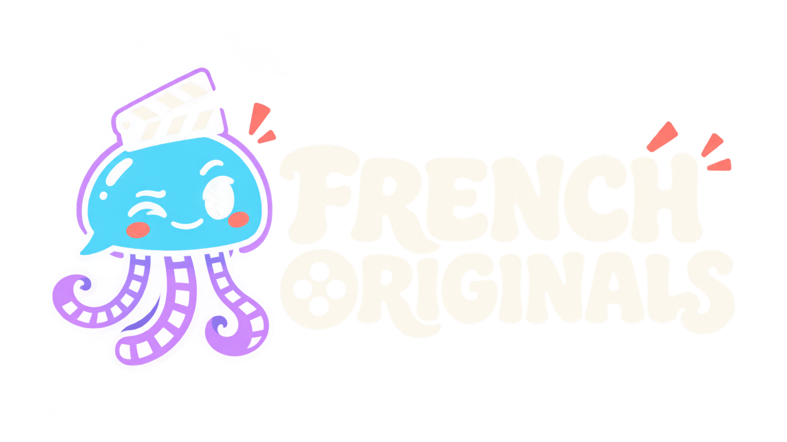

# French Originals for Jellyfin 12

Give French-original films and shows their French titles and summaries. Runs natively from Jellyfin's Scheduled Tasks or the plugin's **Run with saved settings** button. No API key, Python runtime, Docker sidecar, or external scheduler is needed on your server.

**Version 1.0.2.0 — beta.** Fixes a reproduced false verification failure when Jellyfin reads the same image entries back in a different order. Added, removed, replaced, or retyped image references still fail verification. The comparison does not rearrange or change artwork. Existing completion history is retained. Unchanged items stay hidden from reports, and summary-only updates do not appear as renames.

A real-library failure has been narrowed to `Images`, but its expected/actual image lists have not yet been supplied. This release fixes the proven ordering defect; a missing-file reference removed by Jellyfin or another actual image change still requires investigation. Start with preview and a small batch before scheduling apply.

[Download for manual installation](https://raw.githubusercontent.com/wildenrou/Jelly-lang-fix/main/dist/FrenchOriginals-1.0.2-jellyfin12.zip) · [Changes](CHANGELOG.md) · [Validation](VALIDATION.md) · [Source](https://github.com/wildenrou/Jelly-lang-fix) · [Report an issue](https://github.com/wildenrou/Jelly-lang-fix/issues)

## Install from the Jellyfin catalog

In **Dashboard → Plugins → Repositories**, add **French Originals (beta)** with this repository URL:

```text
https://raw.githubusercontent.com/wildenrou/Jelly-lang-fix/main/manifest.json
```

Open the catalog, install **French Originals**, and restart Jellyfin. Select your libraries and keep **Preview only** enabled for the first run. The packages leave automatic plugin updates disabled.

If a manual installation shows **“An error occurred while getting the plugin details from the repository”**, add the repository above and refresh the Plugins page. It supplies the catalog metadata and logo for this plugin, including the original 1.0.0 version. If the warning persists, check the Jellyfin log for a repository download or connectivity error.

## Install on Unraid / Docker

1. Disable any older French-metadata script schedule so both tools do not work on the same items.
2. Stop the Jellyfin container and back up its persistent appdata/config directory. If you use NFO saving, include the affected NFO files in your backup: Jellyfin's normal metadata savers can update them.
3. Extract `FrenchOriginals-1.0.2-jellyfin12.zip`. Copy the **entire `FrenchOriginals_1.0.2.0` folder** into Jellyfin's existing **plugins** directory. When upgrading, remove the old plugin-version folder, keeping the plugin configuration and the `FrenchOriginals` data/journals folder. Do not copy the source ZIP, build dependencies, or the test provider there.
4. Start Jellyfin. Open **Dashboard → Plugins → My Plugins → French Originals**.
5. Select your Movies and TV libraries. Leave **Preview only** enabled, set **Items per run** to `5` for the first check, and save. Click **Run with saved settings**, then **Refresh report**.
6. Review the proposed changes. For an initial apply check, use **Items per run** `1`, disable **Preview only**, save, and run again. If verification fails, inspect the named fields and the journal's `verification-failed` record before another run. Once checks on your server succeed, raise the batch size as appropriate. The default safety guard is `80` selected items.
7. For automation, add a daily trigger under **Dashboard → Scheduled Tasks → French Originals — update metadata**. Choose a time after your library scan normally finishes. No automatic trigger is installed by default.

Use the actual persistent plugins directory for your image. In the official Jellyfin container it is normally `/config/plugins`; LinuxServer images commonly use `/config/data/plugins`. On Unraid these paths map to the host appdata directory shown in the container's volume mappings. The correct directory is the one containing your other plugin folders and `configurations`.

Example resulting layout:

```text
plugins/
  FrenchOriginals_1.0.2.0/
    Jellyfin.Plugin.FrenchOriginals.dll
    meta.json
```

The manual ZIP includes the version folder; the catalog ZIP has the DLL at its root because Jellyfin creates that folder during installation. For manual updates, stop Jellyfin, replace the old plugin folder, and restart. Keep only one installed version of this plugin. No custom .NET installation is required inside the Jellyfin container.

## What changes

- Films and series must have a French `OriginalLanguage` recorded in Jellyfin (`fr`, `fra`, `fre`, including regional forms). French dubbing or subtitles alone do not qualify an item. Missing or ambiguous original languages are skipped.
- The plugin sets `PreferredMetadataLanguage` to `fr`, retaining an already-French regional preference such as `fr-CA`.
- With text updates enabled, it requests French metadata from your library's enabled remote providers, in their configured order. It accepts responses only when an existing provider ID matches and no shared provider ID conflicts. Name-only matches are not accepted.
- Only the preference, unlocked title, and unlocked overview are assigned. Empty provider text never erases existing text. Country, ratings, tags, provider IDs, metadata locks, images, audio/subtitles, and watched status are not intentionally changed. It does not queue a library scan, image refresh, media probe, or full metadata replacement.
- Globally locked items are skipped. Individual title/overview locks remain in force.
- Optional season and episode processing uses a French-original parent series. A locked parent, a known non-French child original language, or an explicit non-French child metadata preference causes that child to be skipped. Children without a verifiable existing provider ID may be skipped even if the series can be updated.
- Unchecking **Update titles and summaries** changes only movie/series language preferences and makes no provider requests. It does not translate existing text; re-enable text updates when needed.

This makes a narrower update than a normal Jellyfin metadata refresh. The plugin copies the requested French title and summary explicitly, rather than requesting a full metadata replacement.

## Safety, retries, and performance

Preview mode may read provider metadata and populate provider caches, but never saves library metadata or completion markers. Its report shows exact proposed titles for the selected batch. Both preview and apply keep diagnostic reports and journals.

Every run inventories the selected libraries before writes. **Items per run** limits the selected batch; `0` selects all pending candidates. Apply refuses the entire batch if its selected count exceeds **Maximum selected items allowed in apply mode**. Each season and episode counts as one item. A preview is not an immutable transaction: apply rechecks the current library and provider results.

Completed items are fingerprinted. Subsequent runs skip them unless their relevant metadata changes, you change between language-only and text mode, or you enable **Recheck completed items**. Items already set to French receive one provider comparison the first time the plugin sees them. If the planned title, summary, and preference already match, the plugin makes no library write and hides that item from the report. If only the summary or language preference changes, the report names those changes without displaying the same title as a rename. Failed or partial lookups remain retryable and move behind unattempted items. Disable **Recheck completed items** for normal daily operation.

Only one plugin run is allowed at a time. Processing is sequential, with a default 200 ms delay between items and a 30-second timeout per provider. The task refuses to run while a library scan or metadata refresh queue is active and stops if one starts. Run again later; completed work is recorded. Cancelling through Scheduled Tasks finishes/verifies an already-started item save, then stops before the next item.

Before each write, the plugin flushes an audit record to disk, checks for concurrent edits, saves through Jellyfin's library API, and reads the stored item back. Verification failure stops subsequent writes. It never directly opens or edits the Jellyfin database. Third-party plugins can still react to Jellyfin's normal item-update events; concurrent changes cannot be made globally atomic across unrelated plugins.

Image verification compares all image types and paths, including duplicate counts, in a stable order. Jellyfin can recreate database image rows during a metadata save, so their returned list order is not a reliable change signal. Actual image-reference differences still stop the batch. The plugin does not restore missing images or suppress changes to their paths or types.

## Reports and recovery

The configuration page displays the last run and up to 200 result rows, excluding unchanged items. Refreshing also hides legacy **No change needed** rows saved by version 1.0.0. Its report endpoint requires administrator privileges. The full journals are JSON Lines files in **`<Jellyfin data directory>/FrenchOriginals/journals`**; this is the data directory containing `jellyfin.db`, which may be one level below the container's `/config`. `last-run.json` and `completed.json` are in the same `FrenchOriginals` data folder. The exact location follows the server's configured paths.

Journals are retained for 30 days by default. `prepared` records contain the old language/title/overview, protected-field values, and the intended changes; `verified` records contain the verified result. A `verification-failed` record contains the actual read-back values and a `Differences` list with `Field`, `Expected`, and `Actual`. The failed item also appears in the report. A failed verification can follow a completed save; it does not roll that save back. For a small manual correction, disable this task and restore the recorded values in Jellyfin's metadata editor. Restoring a full backup is the recovery path for broader changes.

When reporting a failure, share the `Differences` and the plugin/Jellyfin versions. Journals may include media paths and metadata; review them before posting publicly.

If a completion file becomes unreadable, the task stops rather than silently losing its history. With Jellyfin stopped, preserve that file for diagnosis and restore it from backup, or rename only `completed.json` to force a fresh pass. Removing or disabling the plugin does **not** undo changes already applied.

## Limits

French translations must exist in the enabled metadata provider. The plugin does not machine-translate text. Some providers silently return fallback text despite a French request; the plugin cannot reliably detect the language of arbitrary prose. Missing fields are preserved and retried, and explicitly non-French response languages are rejected.

It does not infer a missing original language from filenames, audio tracks, or country. Fix incorrect or absent original-language metadata through Jellyfin or the upstream provider first. It does not change the library's global language, the UI language, preferred audio language, or episode/season numbering.

Compatibility target: **Jellyfin 12.x / .NET 10**. Runtime refuses other major versions. See `VALIDATION.md` for the exact builds tested and remaining limits. Preview a small batch on your own server before enabling scheduled apply.

## Build and tests

Install the .NET 10 SDK on a development machine, then run:

```sh
dotnet restore src/Jellyfin.Plugin.FrenchOriginals --locked-mode
dotnet build src/Jellyfin.Plugin.FrenchOriginals -c Release --no-restore
dotnet run --project tests/FrenchOriginals.Tests -c Release
python3 package.py
```

The plugin references Jellyfin's official 12.0.0 NuGet packages. Its ZIP contains only its own DLL, plugin metadata, logo, and documentation; Jellyfin supplies the framework and host assemblies. Keep the source and license alongside any redistribution. The code is licensed GPL-2.0-only, matching the bundled LICENSE.

The repository contains the corresponding 1.0.2 source. Previous sources remain available in Git history, including [1.0.1](https://github.com/wildenrou/Jelly-lang-fix/tree/84eea2b67bdb14f175e806a49ec028d2d6e8f8ba). The catalog also retains the original 1.0.0 binary for existing installations, with its [exact source archive](dist/FrenchOriginals-1.0.0-source.zip). The logo is original generated artwork provided with the project.

The integration fixture under `tests/SmokeProvider` is for disposable test servers only. It returns synthetic French text and must **never** be installed on a real media server. `tests/run-smoke.py` requires a fresh empty work directory and starts/stops its own server process. See the validation notes for invocation.

## References

- [Jellyfin manual plugin installation](https://jellyfin.org/docs/general/server/plugins/#manual)
- [Jellyfin 12 release and plugin compatibility](https://jellyfin.org/posts/jellyfin-release-12.0/)
- [Jellyfin 12.0 provider API](https://github.com/jellyfin/jellyfin/blob/v12.0/MediaBrowser.Controller/Providers/IProviderManager.cs)
- [Jellyfin 12.0 metadata merge behavior](https://github.com/jellyfin/jellyfin/blob/v12.0/MediaBrowser.Providers/Manager/MetadataService.cs)
